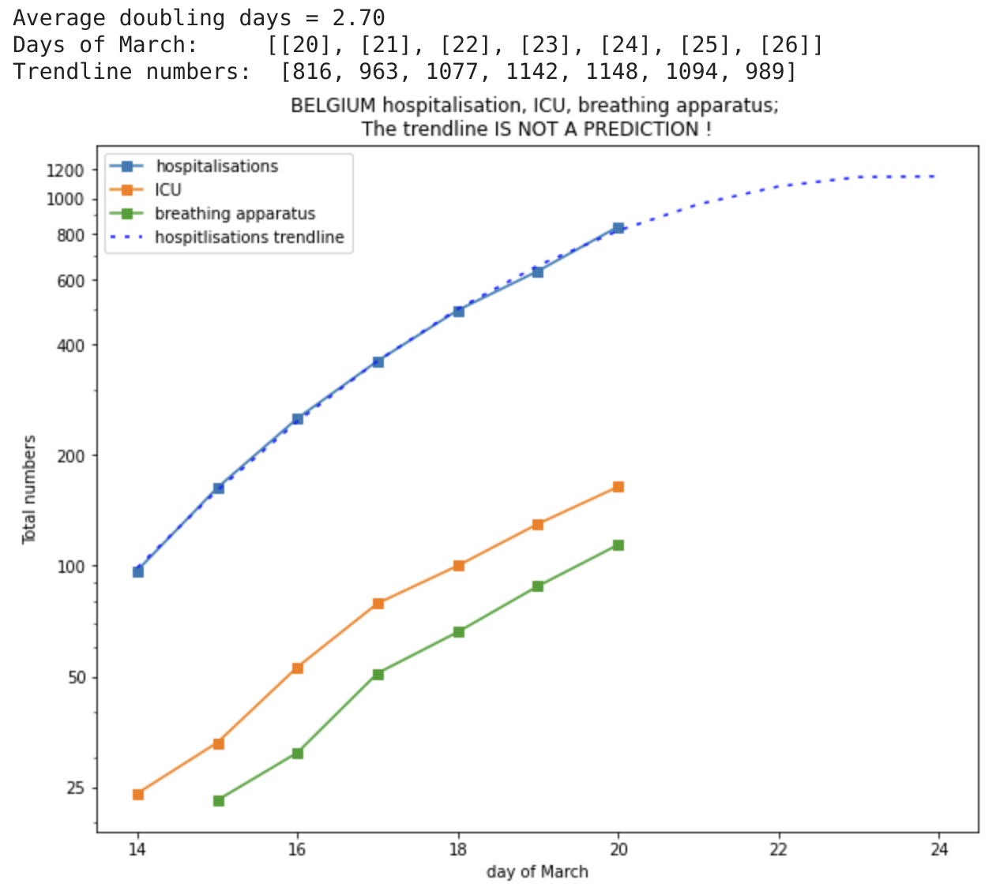

# Plots of covid19 hospitalisations on logarithmic scale and trending.

## Belgium

First Notebook is on https://colab.research.google.com/drive/1O7kH5sxu36atNYDavtEuw4Vw8Wq0SpUW#scrollTo=SER7lP_Rcc39

First plots of these data are on https://twitter.com/peter_v around 18, 19, 20 March 2020.

Please collaborate with comments, PR, forked Notebooks.

Most needed now is data on:

* hospitalisations
* ICU
* breathing apparatus

in different European countries (particularly The Netherlands).

## Why

The reason for these graphs are:

* number of _confirmed cases_ are by definition an underestimation and are dependent on testing _policy_ !
* number of hospitalisations, ICU, breathing apparatus is far less dependent on policy and also has a much harder real-world impact.

The graphs are _logarithmic_ because:

* initially, there is exponential growth ("viral")
* what is the rate of growth (e.g. doubling time) ?
* plotting on _log_ scale shows this as a _straight line_
* shows bending down when the growth rate slows down
* on linear graph, not easy to see that

I am very curious (and worried also) about how the different approach of "hammer and dance" vs. "herd immunity" will affect these numbers and potentially overload of the medical system.

## CAVEAT: About the *trendline*

The trendline *IS NOT A PREDICTION*. It is just a trendline that reasonably well matches the gentle bending down of the curve. But maybe (or probably !) there are and will be external factors that will change the shape of the trendline in the future.

I _hope_ the trendline can be somewhat of a useful indicator for the next days ?? But, "hope is not a strategy".

Also, I am not plotting the number of deceased people here. That graph shows a much faster growth!

## Data source

The source of the data is the daily official press release around 11:00 am that gives these numbers for Belgium.

## Contributors

* The idea was started by Peter Vandenabeele (https://twitter.com/peter_v), for the motivations written above.
* The graph lay-out was improved by and useful discussions with Kris Peeters (https://twitter.com/peeterskris)
* A nicer version of the graph was made by Maarten Lambrechts (https://twitter.com/maartenzam)
