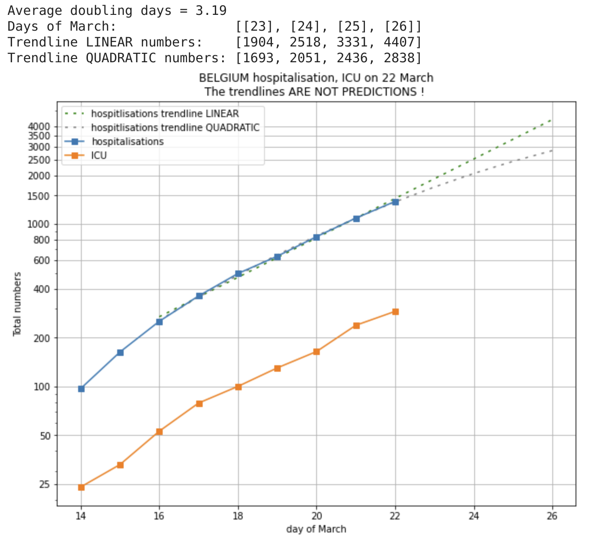
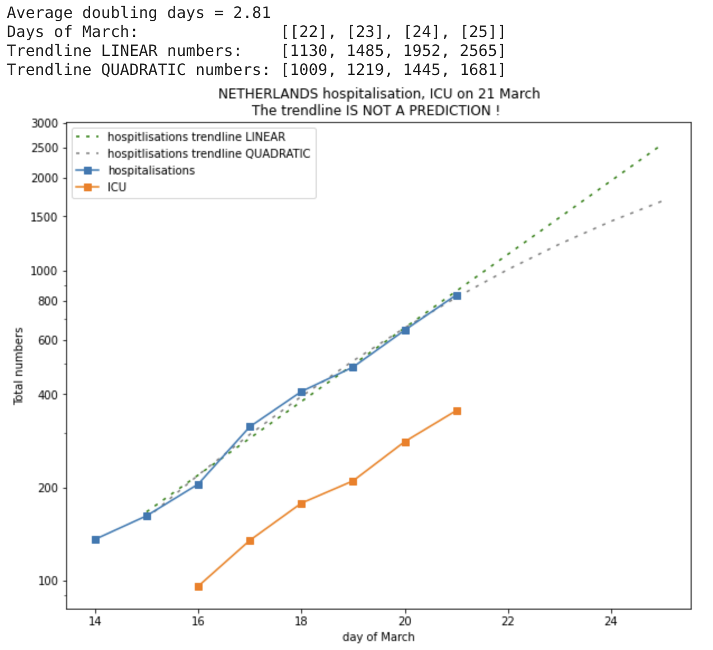

# Plots of covid19 hospitalisations on logarithmic scale and trending.

First Notebook is on https://colab.research.google.com/drive/1O7kH5sxu36atNYDavtEuw4Vw8Wq0SpUW

First plots of these data are on https://twitter.com/peter_v around 18, 19, 20 March 2020. Some of the initial plots with only QUADRATIC trend lines where far too optimistic for the trendline :-/ . I received feedback to not show trendlines or at least use LINEAR trendlines.

As a compromise, I am now showing LINEAR and QUADRATIC trend lines, based on the most recent 7 days.

## Belgium

## Netherlands

Please collaborate with comments, PR, forked Notebooks.

## Why ?

The reason for these graphs are:

* number of _confirmed cases_ are by definition an underestimation and are dependent on testing _policy_ !
* number of hospitalisations and ICU admissions is far less dependent on policy and also has a much harder real-world impact.

The graphs are _logarithmic_ because:

* initially, I assume there is exponential growth ("viral")
* what is the rate of growth (e.g. doubling time) ? (typical numbers on EU graphs now is 2.2 days)
* plotting on _log_ scale shows this as a _straight line_
* shows bending down when the growth rate slows down (which is what we all hope !)
* on a linear veritcal axis, not easy to see that

I am very curious (and worried also) about how the different approach the Netherlands ("herd immunity" ??) will affect these numbers and potentially overload the medical system.

## CAVEAT: About the *trendline*

The trendline *IS NOT A PREDICTION*. It is just a trendline that reasonably well matches the data. I am using only the most recent 7 data points (1 week), because the dynamics will change over time, as a result of changing social behaviors and because of rules imposed by governments.

Again, for clarity, both the 1-order (LINEAR) polynomials and the 2-order (QUADRATIC) polynomials are way too simple to describe the complex behavior for anything more then a short extrapolation. So, do not use this as a prediction ... maybe use as a possible trend for the next days.

So, I _hope_ the trendline can be somewhat of a useful indicator for the next days ?? But, "hope is not a strategy".

Also, I am not plotting the number of deceased people here. That graph shows a very different evolution (much faster relative growth at this moment)!

## Data source

For Belgium, the source of the data is the daily official press release around 11:00 am that gives these numbers for Belgium.

For Netherlands, I mention some sources in the /data directory. Mainly the NOS and nu.nl "Liveblog Corona".

## Contributors

* The idea was started by Peter Vandenabeele (https://twitter.com/peter_v), for the motivations written above.
* The graph lay-out was improved by and useful discussions with Kris Peeters (https://twitter.com/peeterskris)
* A nicer version of the graph was made by Maarten Lambrechts (https://twitter.com/maartenzam)
* Interesting feedback to use LINEAR trend line (or none!) was received from Arnout Devos (https://github.com/ArnoutDevos), Pierre DB and Kris Peeters
* Pull Request for grid lines by Arnout Devos (https://github.com/ArnoutDevos)
