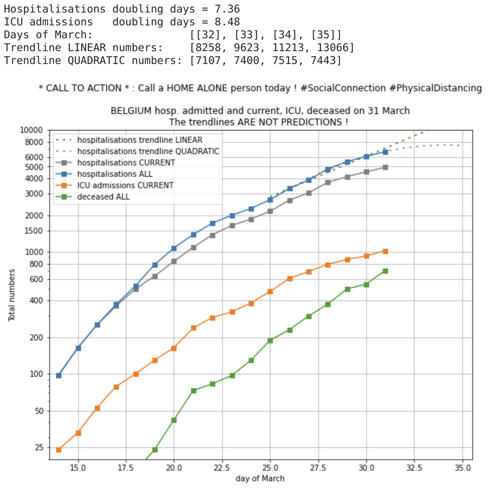
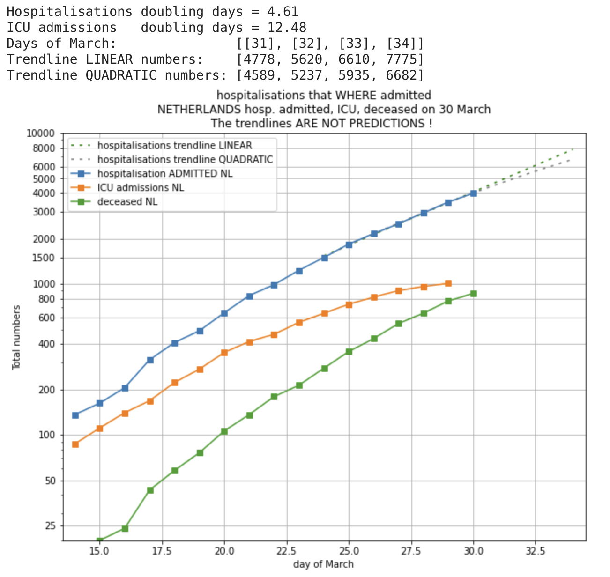

# Plots of covid19 hospitalisations on logarithmic scale and trending.

First Notebook is on https://colab.research.google.com/drive/1O7kH5sxu36atNYDavtEuw4Vw8Wq0SpUW

## Call to ACTION

One thing we ALL can DO is this:

CALL A  **HOME ALONE**  PERSON TODAY !

Let's all contrast the #PhysicalDistancing with massive #SocialConnection and support those that
may feel lonely because of the #PhysicalDistancing measures.

And besided the "good deed", it may even make the Physical Distancing more effective: lonely people that
feel the Social Connection, may find it slightly less hard to obeye the harsh Physical Distancing rules.

Yes, I understand this is an investment of your time and attention, away from the cosy feeling at your
home, but please consider the people that are really "Home Alone" now.

I suggest that besided reporting the 11:00 am cold clinical numbers, at 8:00 pm, around the time we
applaud for the health care workers, we also report how many people we have called today with the
warm tag #SocialConnection.

## Belgium

## Netherlands

Please collaborate with comments, PR, forked Notebooks.

## Why ?

The reasons for these graphs are:

* number of _confirmed cases_ are by definition an underestimation and are dependent on testing _policy_ !
* the number of hospitalisations and ICU admissions is far less dependent on policy and also has a much harder real-world impact.

The graphs are _logarithmic_ because:

* initially, I assume there is exponential growth ("viral")
* what is the rate of growth (e.g. doubling time) ? (worst case number are between 2 and 3 days)
* plotting on _log_ scale shows this as a _straight line_
* in optimistic scenario, should show a bending down when the growth rate slows down
* on a linear veritcal axis, not easy to see that that "relative slow down"

An UPDATE since 2020-03-25 is that for BELGIUM, I now also show the _total number of admitted_ people in hospital. That is the _current_ number of people in hospital + the number of people _discharged_. Otherwise said, all people that have ever been admitted to hospital (some of them are discharged by now). I am not entirely sure if this is complete. What about people that deceased in hospital? What is the exact meaning of "new people admitted to hospital" (it is not high enough to account for growth of people current in hospital + discharges ?)?

My motivations to use the total number of admitted people in BELGIUM is:
* to look more at the INFLUX into the hospitals as a less-biased indicator of the growth of the viral infections in the population.
* to allow more correct comparison with NETHERLANDS ; in the Netherlands, the number that is reported is: "Het totaal aantal gemelde patiënten opgenomen (geweest) in het ziekenhuis: NNNN"

## CAVEAT: About the *trendline*

The trendline *IS NOT A PREDICTION*. It is just a trendline that reasonably well matches the data on short term. I am using only the most recent 7 data points (1 week), because the dynamics will change over time, as a result of changing social behaviors and because of rules imposed by governments.

Again, for clarity, both the 1-order (LINEAR) polynomials and the 2-order (QUADRATIC) polynomials are way too simple to describe the complex behavior for anything more then a short extrapolation. So, do not use this as a prediction ... maybe use as a possible trend for the next days.

So, I _hope_ the trendline can be somewhat of a useful indicator for the next days ?? But, "hope is not a strategy".

## Data source

For Belgium, the source of the data is the daily official press release around 11:00 am that gives these numbers for Belgium. These are reported i.a. on destandaard.be and vrt news liveblog like https://www.vrt.be/vrtnws/nl/2020/03/27/liveblog-28-maart/

For Netherlands, I mention some sources in the /data directory. Mainly RIVM https://www.rivm.nl/nieuws/actuele-informatie-over-coronavirus and for ICU https://stichting-nice.nl/

## Contributors

* The idea was started by Peter Vandenabeele (https://twitter.com/peter_v), for the motivations written above.
* The graph lay-out was improved by and useful discussions with Kris Peeters (https://twitter.com/peeterskris)
* A nicer version of the graph was made by Maarten Lambrechts (https://twitter.com/maartenzam)
* Interesting feedback to use LINEAR trend line (or none!) was received from Arnout Devos (https://github.com/ArnoutDevos), Pierre DB and Kris Peeters
* Pull Request for grid lines by Arnout Devos (https://github.com/ArnoutDevos)
